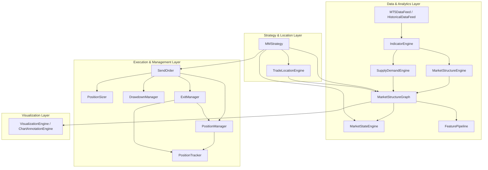

# Professional Forex Trading Framework (Market-Driven Refactored)

A robust, modular, and environment-agnostic automated trading framework for MetaTrader 5. Designed for professional algorithmic trading, backtesting, and machine learning research.

The framework utilizes a centralized, deterministic, **market-driven pipeline** centered around a shared `MarketStructureGraph` representation.

## Project Overview

This framework provides a complete ecosystem for developing, testing, and deploying intraday Forex trading strategies. It decouples market data acquisition, signal generation, risk management, and order execution into independent, state-managed modules.

Key capabilities include:
- **Centralized Market Structure Graph**: No strategy recalculates trends or swing levels; everything is calculated once and exposed in a unified `MarketStructureGraph`.
- **Decoupled Analytical Engines**: Dedicated, stateless engines (`MarketStructureEngine`, `SupplyDemandEngine`, and `MarketStateEngine`) build the market model.
- **Environment Agnostic Execution**: Seamlessly switch between Live trading and Historical simulation using the `env` abstraction.
- **Advanced Exit and Location Engines**: Centralized `TradeLocationEngine` resolves structural Stop Loss and Take Profit levels without hard-coded pip distances.
- **Forensic Trade Auditing**: Reconstruct the complete lifecycle of any trade from multiple data sources (Journal, State, Broker History).

## Architecture Diagram



## Module Overview

| Module | Responsibility |
| :--- | :--- |
| **DataFeed** | Unified interface for live MT5 data and historical CSV loading. |
| **IndicatorEngine** | Optimized technical indicator calculation (EMA, ATR, Slopes). |
| **MarketStructureEngine**| Detects BOS, CHOCH, swings, and protected levels. |
| **SupplyDemandEngine**  | Tracks institutional supply and demand zones. |
| **MarketStructureGraph** | Centralized, shared object-oriented representation of the market. |
| **MarketStateEngine**    | Identifies trend, range, transition, and expansion regimes. |
| **FeaturePipeline**     | Generates ML-ready structured features from the graph. |
| **TradeLocationEngine**  | Resolves SL/TP coordinates strictly using structure. |
| **MMStrategy** | Intraday signal logic (Standard, High-Risk, Reversal). |
| **RiskSizing** | Mathematical lot size calculation based on account risk %. |
| **PositionManager** | Environment-agnostic broker interaction (Open, Close, Modify). |
| **PositionTracker** | Real-time monitoring of open positions and active risk. |
| **ExitManager** | Rule-based trade management (Staged TP/SL). |
| **SendOrder** | Orchestration of entry rules, conflicts, and registration. |
| **TradingJournal** | Multi-layer event logging (Append-only events + LifeCycle summaries). |
| **TradeAuditor** | Forensic reconstruction of trade history and consistency checks. |
| **VisualizationEngine** | Passively annotates detected structures on charts and notebooks. |

## Installation

1. **Clone the repository**:
   ```bash
   git clone https://github.com/your-repo/forex-trading-framework.git
   cd forex-trading-framework
   ```

2. **Install Dependencies**:
   ```bash
   pip install -r requirements.txt
   ```

3. **Configure MetaTrader 5**:
   - Ensure MT5 is installed (Windows environment required for live trading).
   - Enable "Allow Algo Trading" in MT5 settings.
   - For Linux/CI, the framework uses mocks to allow non-execution testing.

## Folder Structure

```text
├── Collecting_Data/      # Data acquisition, indicators, journaling, lifecycle
├── Market_Data_Pipeline/ # Core market intelligence layer (MSG, MSE, SDE, State, FP)
├── Trade_Execution/      # Execution, tracking, risk, location, and exit management
├── Strategies/           # Strategy implementations (MMStrategy)
├── Visualization/        # ChartAnnotationEngine for visual debugging
├── simulation/           # Historical simulation engine and virtual environment
├── docs/                 # Detailed architecture and module documentation
├── State/                # Persistence files for framework recovery
├── Journals/             # Layer 1 (Events) and Layer 2 (Summaries) logs
├── main.py               # Live trading entry point
├── live_validation.py    # Production readiness checklist
└── integration_validation.py # End-to-end mock-based validation suite
```

## Quick Start

### 1. Configuration
Create a `credentials.json` in the root:
```json
{
  "mt5": {
    "login": 12345678,
    "password": "your_password",
    "server": "Broker-Server"
  }
}
```

### 2. Live Trading
```bash
python main.py
```

### 3. Backtesting
Refer to `docs/backtesting.md` for a complete tutorial on running historical simulations.

## Passive Visualization Engine

The new `VisualizationEngine` (`ChartAnnotationEngine`) runs in parallel to the system. It subscribes to the `MarketStructureGraph` and overlays drawing layers:
- **swings**: Swing Highs/Lows and Protected levels.
- **structure**: BOS and CHOCH markers.
- **zones**: Active Supply and Demand zones.
- **levels**: Structural Stop Loss, Take Profit, and Entry candidates.
- **signals**: Accepted and rejected signals with gray/colored markers.

Debugging is fully interactive and customizable via `Visualization/debug_config.py`.
