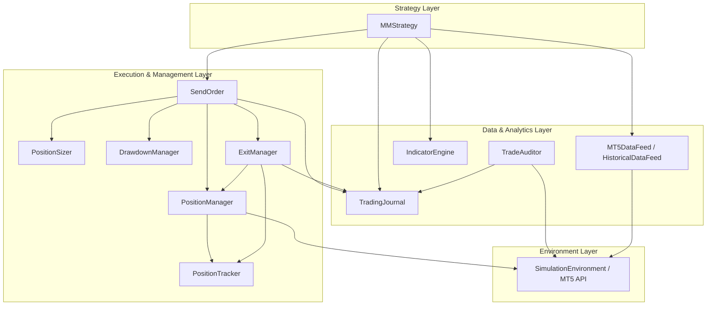

# Professional Forex Trading Framework

A robust, modular, and environment-agnostic automated trading framework for MetaTrader 5. Designed for professional algorithmic trading, backtesting, and machine learning research.

## Project Overview

This framework provides a complete ecosystem for developing, testing, and deploying intraday Forex trading strategies. It decouples market data acquisition, signal generation, risk management, and order execution into independent, state-managed modules.

Key capabilities include:
- **Environment Agnostic Execution**: Seamlessly switch between Live trading and Historical simulation using the `env` abstraction.
- **Multi-Staged Trade Management**: Advanced exit profiles with partial closes, breakeven moves, and progressive trailing stops.
- **Forensic Trade Auditing**: Reconstruct the complete lifecycle of any trade from multiple data sources (Journal, State, Broker History).
- **Machine Learning Integration**: Built-in pipelines for dataset generation and model validation using professional financial metrics.

## Architecture Diagram



## Module Overview

| Module | Responsibility |
| :--- | :--- |
| **DataFeed** | Unified interface for live MT5 data and historical CSV loading. |
| **IndicatorEngine** | Optimized technical indicator calculation (EMA, ATR, Slopes). |
| **MMStrategy** | Intraday signal logic (Standard, High-Risk, Reversal). |
| **RiskSizing** | Mathematical lot size calculation based on account risk %. |
| **PositionManager** | Environment-agnostic broker interaction (Open, Close, Modify). |
| **PositionTracker** | Real-time monitoring of open positions and active risk. |
| **ExitManager** | Rule-based trade management (Staged TP/SL). |
| **SendOrder** | Orchestration of entry rules, conflicts, and registration. |
| **TradingJournal** | Multi-layer event logging (Append-only events + LifeCycle summaries). |
| **TradeAuditor** | Forensic reconstruction of trade history and consistency checks. |
| **Historical Simulation** | High-fidelity backtesting engine with virtual clock and broker. |
| **Statistics Engine** | Performance metric calculation (Win Rate, Profit Factor, Expectancy). |

## Installation

1. **Clone the repository**:
   ```bash
   git clone https://github.com/your-repo/forex-trading-framework.git
   cd forex-trading-framework
   ```

2. **Install Dependencies**:
   ```bash
   pip install -r requirements.txt
   ```

3. **Configure MetaTrader 5**:
   - Ensure MT5 is installed (Windows environment required for live trading).
   - Enable "Allow Algo Trading" in MT5 settings.
   - For Linux/CI, the framework uses mocks to allow non-execution testing.

## Dependencies

- Python 3.10+
- MetaTrader5 (Live execution)
- Pandas / NumPy (Data processing)
- Scikit-learn / TensorFlow (ML components)
- python-dotenv (Environment management)

## Folder Structure

```text
├── Collecting_Data/      # Data acquisition, indicators, journaling, lifecycle
├── PositionManager/      # Execution, tracking, risk, and exit management
├── Strategies/           # Strategy implementations (MMStrategy)
├── simulation/           # Historical simulation engine and virtual environment
├── docs/                 # Detailed architecture and module documentation
├── State/                # Persistence files for framework recovery
├── Journals/             # Layer 1 (Events) and Layer 2 (Summaries) logs
├── AuditReports/         # Output from TradeAuditor
├── main.py               # Live trading entry point
├── live_validation.py    # Production readiness checklist
└── integration_validation.py # End-to-end mock-based validation suite
```

## Quick Start

### 1. Configuration
Create a `credentials.json` in the root:
```json
{
  "mt5": {
    "login": 12345678,
                "password": "your_password",
                "server": "Broker-Server"
  }
}
```

### 2. Live Trading
```bash
python main.py
```

### 3. Backtesting
Refer to `docs/backtesting.md` for a complete tutorial on running historical simulations.

## Configuration

The framework is highly configurable via class constructors. Key parameters include:
- **Risk Management**: Daily and total drawdown limits, per-signal risk caps.
- **Exit Profiles**: Selection between `standard` (TP1->BE->TP2) and `single` (TP1->Close).
- **Timeframes**: Support for M5, M15, and others provided by MT5.

See `docs/configuration.md` for a full parameter reference.

## Live Trading

The `main.py` entry point initializes the full dependency graph and starts background polling threads for Tracking, Exit Management, and Strategy evaluation.

**Safety Features:**
- **Drawdown Guard**: Automatically blocks new signals if limits are breached.
- **Connection Health**: `MT5DataFeed` monitors API latency and data freshness.
- **Conflict Management**: `SendOrder` prevents duplicate or conflicting positions on the same symbol.

## Backtesting

The `simulation/` module provides a high-fidelity environment that mocks the MT5 API.
1. Load historical OHLCV data via `HistoricalDataFeed`.
2. Run `SimulationRunner` to step through time.
3. Generate detailed performance reports via `StatisticsEngine`.

## Training & Machine Learning

The framework supports a complete ML lifecycle:
1. **Dataset Generation**: Use the `TradingJournal` to export features and labels.
2. **Model Training**: Located in `DNN/` and `RL_Approach/`.
3. **Inference**: Strategies can load saved models for real-time signal filtering.

Refer to `docs/training.md` for the ML workflow.

## Logging & Journaling

The framework utilizes a two-layer journaling system:
- **Layer 1 (Event Journal)**: Real-time, append-only chronological log of every action (signal, order, partial close, etc.).
- **Layer 2 (Position Summary)**: Canonical `PositionLifecycle` objects generated after trade closure, containing final PnL and metrics.

## TradeAuditor

The `trade_auditor.py` tool is used for forensic analysis. It can reconstruct a trade's timeline even after a system crash by aggregating data from Journals, State files, and Broker history.

```bash
python trade_auditor.py --ticket 12345678
```

## State Management & Recovery

All critical framework states (open positions, drawdown, exit stages) are persisted to `State/*.json`. Upon restart, the framework automatically reconciles its internal state with the broker to resume management of existing trades.

## Common Workflows

- **Adding a Symbol**: Update `SYMBOLS` list in `main.py`.
- **Creating a Strategy**: Inherit from the strategy interface and implement `_poll_cycle`.
- **Auditing a Loss**: Use `TradeAuditor` to inspect the `PositionLifecycle` and verify if rules were followed.

## Future Roadmap

- Support for Hedging accounts.
- Multi-asset correlation filters.
- Web-based dashboard for real-time monitoring.
- Integration with external Alpha streams.

## Known Limitations

- Requires MetaTrader 5 (Windows) for live execution.
- Single-thread strategy execution (scaling to hundreds of symbols may require sharding).
- Partial closes depend on broker support for specific lot increments.
