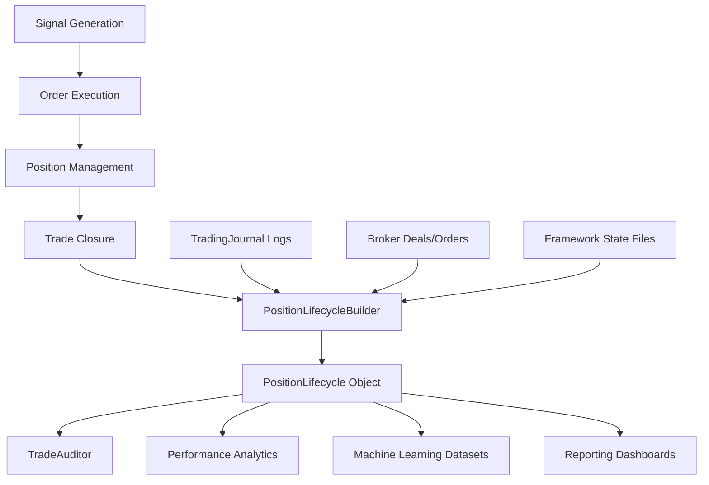

# PositionLifecycle

## Purpose
The `PositionLifecycle` object is the canonical representation of a completed trading position within the framework. It serves as the single source of truth for all downstream modules, including journaling, auditing, performance analytics, and machine learning dataset generation.

By consolidating all information related to a trade's lifecycle—from signal generation to final outcome—into a single immutable object, we eliminate duplicated reconstruction logic and ensure consistency across the entire system.

## Architecture
`PositionLifecycle` is designed as an immutable domain object (implemented as a frozen dataclass in Python). It is divided into four logical sections:

1.  **Signal Information**: Context of why the trade was initiated.
2.  **Execution Information**: Details of how the trade was opened at the broker.
3.  **Management Information**: Record of how the position was handled while open (e.g., partial closes, SL moves).
4.  **Outcome Information**: Final results and performance metrics.

## Flow Diagram

## Construction Process
`PositionLifecycle` objects are created exclusively by the `PositionLifecycleBuilder`. The builder aggregates data from three primary sources:
1.  **TradingJournal**: Event logs (signal, order_open, partial_close, outcome).
2.  **Broker History**: Actual deals and orders retrieved from the trading terminal (e.g., MT5).
3.  **Framework State**: Snapshots of internal state (e.g., `ExitManager` or `PositionTracker` states).

## Field Definitions

### 1. Signal Information
| Field | Description |
|-------|-------------|
| `signal_id` | Unique identifier for the signal (UUID). |
| `strategy` | Name of the strategy that generated the signal. |
| `signal_category` | Category of the signal (e.g., standard, high_risk, reversal). |
| `symbol` | Trading instrument (e.g., EURUSD_o). |
| `timeframe` | Chart timeframe (e.g., M5, M15). |
| `direction` | 1 for BUY, -1 for SELL. |
| `signal_timestamp` | When the signal was generated (ISO 8601). |
| `bar_timestamp` | The timestamp of the bar the signal was based on. |
| `indicator_snapshot` | Key indicator values at the time of the signal. |
| `market_snapshot` | Additional market context (e.g., spread, volatility). |

### 2. Execution Information
| Field | Description |
|-------|-------------|
| `ticket` | Primary broker ticket ID for the position. |
| `magic_number` | Magic number used for the trade. |
| `requested_entry` | Price requested by the strategy. |
| `actual_entry` | Price at which the first deal was filled. |
| `average_entry` | Volume-weighted average entry price. |
| `initial_volume` | Total lot size initially opened. |
| `remaining_volume` | Volume currently remaining in the position. |
| `risk_percent` | Percentage of account balance at risk. |
| `risk_amount` | Dollar amount at risk. |
| `initial_stop_loss` | Original stop loss price. |
| `initial_take_profit` | Original take profit price. |
| `spread` | Spread at the moment of execution. |
| `slippage` | Difference between requested and actual entry. |
| `execution_latency` | Time between signal generation and execution (seconds). |
| `broker_order_ids` | List of all broker order IDs related to this position. |
| `broker_deal_ids` | List of all broker deal IDs related to this position. |

### 3. Management Information
| Field | Description |
|-------|-------------|
| `partial_closes` | List of partial close events (volume, price, time). |
| `breakeven_events` | Record of when the SL was moved to entry. |
| `trailing_events` | Record of trailing stop adjustments. |
| `stop_loss_modifications` | All changes made to the SL. |
| `take_profit_modifications` | All changes made to the TP. |
| `maximum_favorable_excursion` | Highest profit reached during the trade (points/dollars). |
| `maximum_adverse_excursion` | Lowest profit reached during the trade (points/dollars). |
| `highest_profit` | Peak equity during the trade. |
| `lowest_profit` | Maximum drawdown during the trade. |
| `time_in_market` | Duration the position was active (seconds). |
| `current_stage` | The final management stage reached (for staged exits). |
| `management_events` | Timeline of all management actions taken. |

### 4. Outcome Information
| Field | Description |
|-------|-------------|
| `exit_timestamp` | When the position was fully closed. |
| `average_exit_price` | Volume-weighted average exit price. |
| `close_price` | Price of the final closing deal. |
| `realized_profit` | Net profit/loss in account currency. |
| `profit_points` | Profit/loss in points. |
| `profit_pips` | Profit/loss in pips. |
| `profit_percent` | Return on account balance. |
| `r_multiple` | Risk-to-reward ratio achieved (e.g., 2.5R). |
| `result` | Label for the outcome (e.g., tp1, tp2, sl, manual). |
| `strategy_reason` | Why the strategy decided to close. |
| `broker_reason` | Broker code for closure (e.g., DEAL_REASON_SL). |
| `deal_count` | Number of deals associated with the position. |
| `partial_close_count` | Number of partial closes executed. |
| `duration` | Total duration from signal to final exit (seconds). |
| `status` | Current status (e.g., completed, open, cancelled). |

## Serialization
The `PositionLifecycle` object supports multiple serialization formats:
- **Dictionary**: `to_dict()`
- **JSON**: `to_json()`
- **CSV Row**: `to_csv_row()` (Flattened for logging)
- **Markdown**: `to_markdown()` (Human-readable report)

## Relationships

### Signal vs PositionLifecycle
A `Signal` is the "intent" to trade. A `PositionLifecycle` includes the signal but extends it with execution and outcome data.

### Deal/Order vs PositionLifecycle
`Deals` and `Orders` are broker-specific atomic actions. `PositionLifecycle` aggregates these into a logical "trade" unit.

### TradingJournal vs PositionLifecycle
The `TradingJournal` logs events as they happen. `PositionLifecycle` is the post-hoc reconstruction of those events into a structured object.

### TradeAuditor vs PositionLifecycle
The `TradeAuditor` uses the `PositionLifecycleBuilder` to generate the `PositionLifecycle` object, which it then uses to format its reports.
