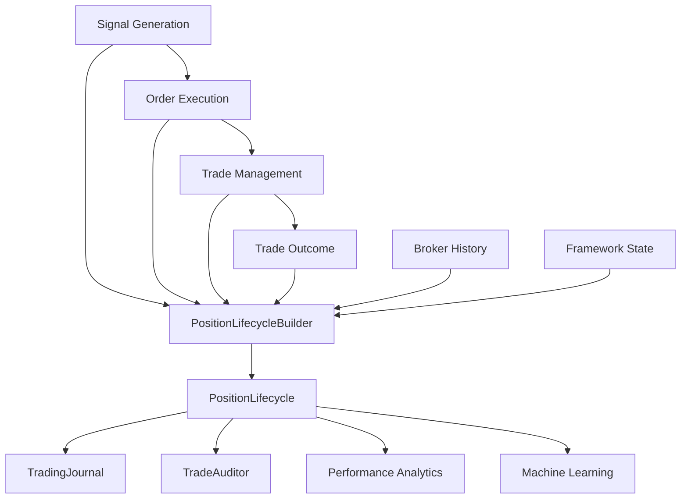

# Position Lifecycle

## Purpose
The `PositionLifecycle` object is the canonical representation of a completed trading position in the framework. It serves as the single source of truth for all downstream modules, including journaling, auditing, performance analytics, and machine learning.

The goal is to eliminate duplicated reconstruction logic across modules. Instead of each module independently interpreting broker deals, they consume the `PositionLifecycle` object.

## Architecture

## Object Lifecycle
1.  **Signal:** A trade signal is generated and logged.
2.  **Execution:** An order is opened on the broker terminal.
3.  **Management:** The trade is managed (partial closes, SL/TP moves).
4.  **Outcome:** The trade is closed.
5.  **Construction:** The `PositionLifecycleBuilder` aggregates data from the journal, broker, and state files to create the `PositionLifecycle` object.
6.  **Persistence:** The object is logged as the final canonical record.

## Field Definitions

### 1. Signal Information (`SignalInfo`)
- `signal_id`: Unique identifier for the signal.
- `strategy`: Strategy name (e.g., "MMStrategy").
- `signal_category`: Category (standard, high_risk, reversal).
- `symbol`: Trading symbol (e.g., "EURUSD_o").
- `timeframe`: Chart timeframe (e.g., "M5").
- `direction`: 1 for Buy, -1 for Sell.
- `signal_timestamp`: Time the signal was generated.
- `bar_timestamp`: Time of the candle that triggered the signal.
- `indicator_snapshot`: Key technical indicator values at signal time.
- `market_snapshot`: Broader market context (spread, session, etc.).

### 2. Execution Information (`ExecutionInfo`)
- `ticket`: Broker position ticket.
- `magic_number`: Strategy identifier.
- `requested_entry`: Price requested by the strategy.
- `actual_entry`: Fill price from the broker.
- `average_entry`: Volume-weighted entry price.
- `initial_volume`: Lot size at opening.
- `remaining_volume`: Lot size remaining after partial closes.
- `risk_percent`: Risk as percentage of account balance.
- `risk_amount`: Risk in account currency.
- `initial_stop_loss`: Initial SL price.
- `initial_take_profit`: Initial TP price.
- `spread`: Spread at execution.
- `slippage`: Difference between requested and actual entry.
- `execution_latency`: Delay between signal and execution.
- `broker_order_ids`: List of orders associated with this position.
- `broker_deal_ids`: List of deals associated with this position.

### 3. Management Information (`ManagementInfo`)
- `partial_closes`: List of partial close events.
- `breakeven_events`: List of times SL was moved to entry.
- `trailing_events`: List of trailing stop movements.
- `stop_loss_modifications`: All SL price changes.
- `take_profit_modifications`: All TP price changes.
- `maximum_favorable_excursion`: Max profit reached (points/pips).
- `maximum_adverse_excursion`: Max drawdown reached (points/pips).
- `highest_profit`: Max profit reached (currency).
- `lowest_profit`: Max drawdown reached (currency).
- `time_in_market`: Total seconds from open to close.
- `current_stage`: Last reached stage (for staged TP strategies).
- `management_events`: Chronological list of all management actions.

### 4. Outcome Information (`OutcomeInfo`)
- `exit_timestamp`: Time of final closure.
- `average_exit_price`: Volume-weighted exit price.
- `close_price`: Last exit deal price.
- `realized_profit`: Total profit/loss in currency.
- `profit_points`: Profit in raw points.
- `profit_pips`: Profit in pips.
- `profit_percent`: Profit as % of account.
- `r_multiple`: Return relative to initial risk.
- `result`: Outcome label (e.g., "tp2", "sl", "manual").
- `strategy_reason`: Why the strategy decided to exit.
- `broker_reason`: Close reason from the broker (e.g., "stop_loss").
- `deal_count`: Total number of deals (entry + partials + exit).
- `partial_close_count`: Number of partial closes executed.
- `duration`: Total trade duration in seconds.
- `status`: Final state ("completed" or "open").

## Serialization
The `PositionLifecycle` object supports multiple formats:
- **Dictionary:** `to_dict()`
- **JSON:** `to_json()`
- **CSV:** `to_csv_row()` (flattened)
- **Markdown:** `to_markdown()` (formatted report)

## Relationship with Other Objects
- **Signal:** The starting point. `PositionLifecycle` contains the full `SignalInfo`.
- **Deal/Order:** Low-level broker events. Reconstructed into `ExecutionInfo` and `ManagementInfo`.
- **Position:** The live entity. `PositionLifecycle` is the post-mortem summary.
- **TradingJournal:** The primary storage. `PositionLifecycle` is built from journal events.
- **TradeAuditor:** The diagnostic tool. Now consumes `PositionLifecycle` for reporting.
