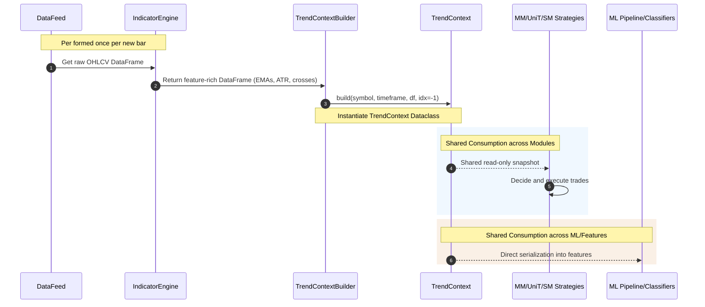

# TrendContext Architecture Documentation

## Purpose of the TrendContext Architecture

The `TrendContext` architecture introduces a clean separation of concerns within the `Forex_DNN` trading framework. Traditionally, the trend analysis logic (such as trend direction, moving average separation, EMA slopes, and strength classification) was computed inside individual strategy classes (like `MMStrategy`). This tightly coupled market analysis with trading execution, leading to:
- Code duplication across strategies (e.g., `MMStrategy`, `UniTStrategy`, `SMStrategy`).
- Inconsistent trend definitions and metrics between strategy logic, live logging, and Machine Learning training datasets.
- Redundant and slow re-computations at every execution step.

The new design addresses this by computing the market's trend context **once per bar** in a single reusable `TrendContext` object. This object acts as a read-only snapshot of the market state that is passed directly to any strategies, ML models, and downstream features pipeline.

---

## Separation of Responsibilities

```
    ┌──────────────┐
    │   DataFeed   │
    └──────┬───────┘
           │ OHLCV DataFrame
           ▼
  ┌─────────────────┐
  │ IndicatorEngine │
  └────────┬────────┘
           │ Indicator Columns (EMA, ATR)
           ▼
 ┌────────────────────┐
 │TrendContextBuilder │
 └─────────┬──────────┘
           │ build()
           ▼
    ┌──────────────┐
    │ TrendContext │
    └──────┬───────┘
           ├─────────────────────────┬─────────────────────────┐
           ▼                         ▼                         ▼
    ┌──────────────┐          ┌──────────────┐          ┌──────────────┐
    │  MMStrategy  │          │ UniTStrategy │          │  SMStrategy  │
    └──────────────┘          └──────────────┘          └──────────────┘
           ├─────────────────────────┼─────────────────────────┤
           ▼                         ▼                         ▼
┌──────────────────────┐  ┌──────────────────────┐  ┌──────────────────────┐
│  FeaturePipeline     │  │MarketStateClassifier │  │LevelBreakProbModel   │
└──────────────────────┘  └──────────────────────┘  └──────────────────────┘
```

### 1. Market Data & Indicator Level
- **DataFeed**: Fetches and prepares sequential OHLCV bars.
- **IndicatorEngine**: Calculates moving averages (EMA50, EMA600, EMA800) and ATR columns stateless-ly on the DataFrame.

### 2. Trend Context Level (New Module)
- **TrendContextBuilder**: Consumes the indicator DataFrame, computes trend directions, distances, slopes, classifications, and durations since events, then produces a populated `TrendContext` instance.
- **TrendContext (Dataclass)**: A simple, immutable container of market context values. It contains **no trading decisions**, and serves as the single source of truth.

### 3. Execution & Downstream Level
- **Trading Strategies (MM, UniT, SM)**: Decides *when* and *how* to trade (sizing, stop loss, triggers, candle patterns, entry timing) based strictly on the provided `TrendContext`.
- **Machine Learning Modules**: Serializes `TrendContext` directly to features (avoiding re-computations in the FeaturePipeline).

---

## Field-by-Field Attribute Explanation

The `TrendContext` dataclass contains the following attributes:

| Field Name | Type | Description |
|---|---|---|
| `symbol` | `str` | The financial instrument (e.g., `EURUSD_o`). |
| `timeframe` | `str` | The chart timeframe (e.g., `M5`, `M15`). |
| `timestamp` | `datetime` | The specific point-in-time datetime for the context snapshot. |
| `trend_direction` | `str` | General trend direction: `"Bull"` (EMA50 > EMA600/800) or `"Bear"` (EMA50 < EMA600/800). |
| `ema_fast` | `float` | Value of the EMA50 indicator. |
| `ema_slow` | `float` | Value of the timeframe-specific slow EMA (EMA600 for M5, EMA800 for M15). |
| `ema_slope` | `float` | The ATR-normalized slope of the slow EMA (EMA600/800 slope). |
| `ema_distance` | `float` | Raw absolute distance between `ema_fast` and `ema_slow`. |
| `ema_distance_atr` | `float` | Separation between `ema_fast` and `ema_slow` normalized by ATR (`ema_distance / atr_14`). |
| `trend_strength` | `str` | Categorical classification: `"Very Strong"`, `"Strong"`, `"Normal"`, or `"Weak"`. |
| `is_strong_trend` | `bool` | Convenience boolean: `True` if `trend_strength` is `"Very Strong"` or `"Strong"`. |
| `is_weak_trend` | `bool` | Convenience boolean: `True` if `trend_strength` is `"Weak"`. |
| `bars_since_cross` | `int` | Number of bars since the candle last crossed the fast EMA (`cross_ema_50 != 0`). |
| `bars_since_trend_change` | `int` | Number of bars since `trend_direction` shifted (when `ema_fast` crossed `ema_slow`). |

---

## Integration and Consumption Examples

### 1. MM Strategy (`MMStrategy`)
```python
# Create a TrendContext via the builder
builder = TrendContextBuilder(slope_threshold=self.m5_slope_threshold)
trend_context = builder.build(symbol, timeframe, df, idx=-1)

# Pass the context into evaluation logic
if self._evaluate_standard(bar_closed, trend_context):
    self._process_signal(symbol, timeframe, "standard", 1, df, trend_context)
```

### 2. UniT Strategy / SM Strategy (Future Compatibility)
```python
# The same context object can be passed to other strategy modules
unit_strategy.evaluate(bar_closed, trend_context)
sm_strategy.evaluate(bar_closed, trend_context)
```

### 3. ML Feature Pipeline (`FeaturePipeline`)
Since every field in `TrendContext` maps to one or more ML features, serialization is simple and avoids any lookahead or re-computation bias:
```python
# Serializing TrendContext to ML dataset records
features = {
    "feature_trend_direction": 1.0 if context.trend_direction == "Bull" else -1.0,
    "feature_ema_slope": context.ema_slope,
    "feature_ema_distance_atr": context.ema_distance_atr,
    "feature_is_strong": 1.0 if context.is_strong_trend else 0.0,
    "feature_bars_since_cross": float(context.bars_since_cross),
    "feature_bars_since_trend_change": float(context.bars_since_trend_change)
}
```

---

## Architecture Sequence Diagram


